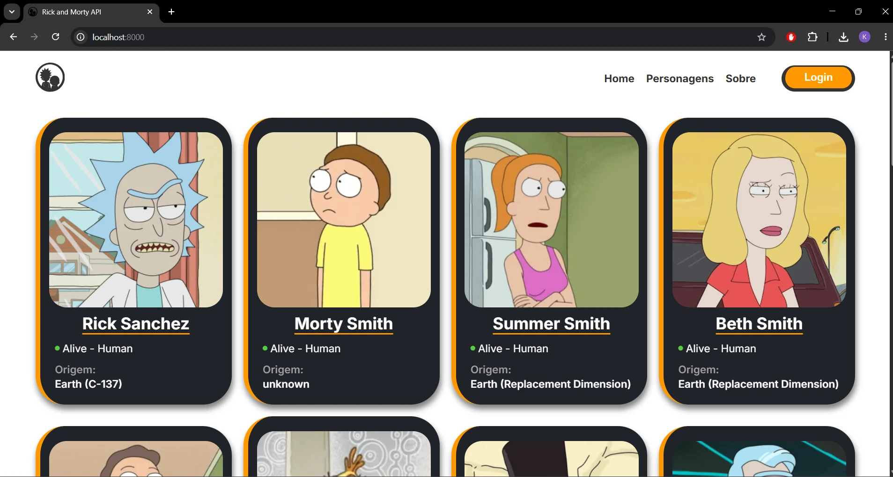
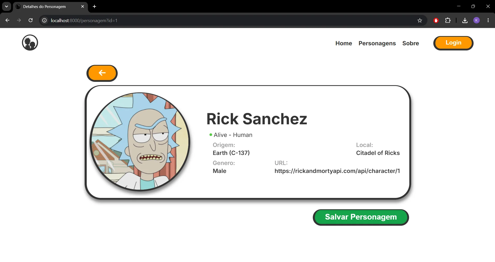
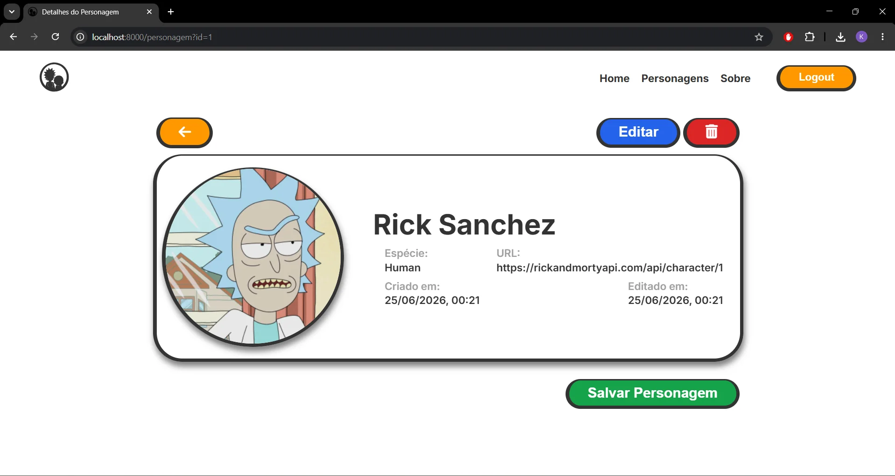
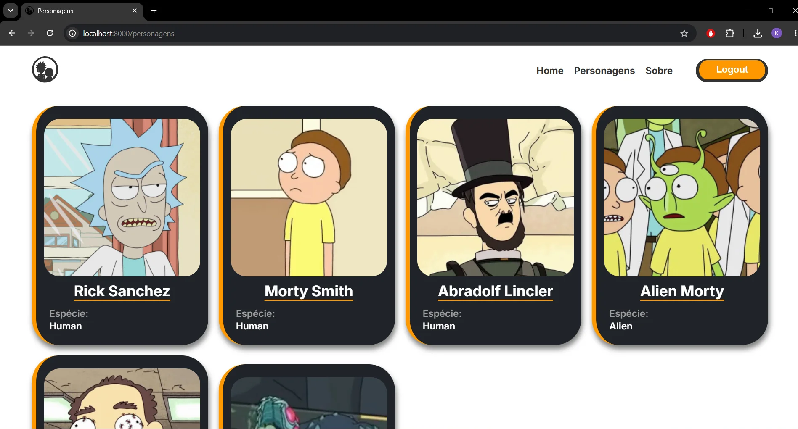
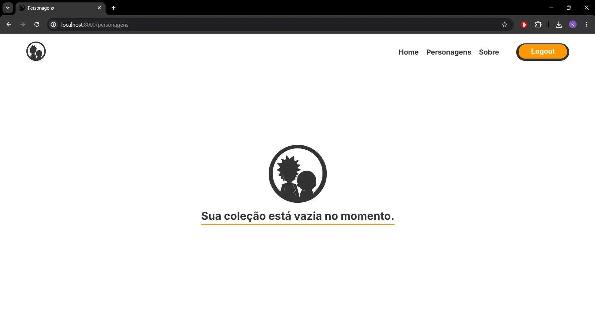
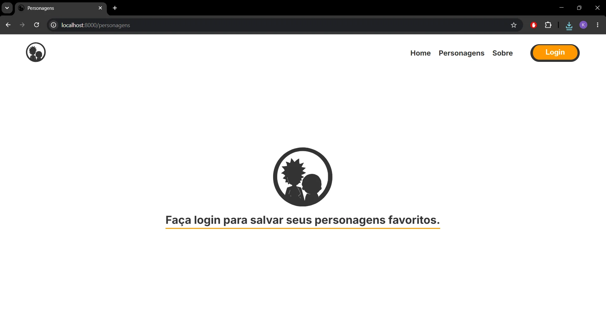
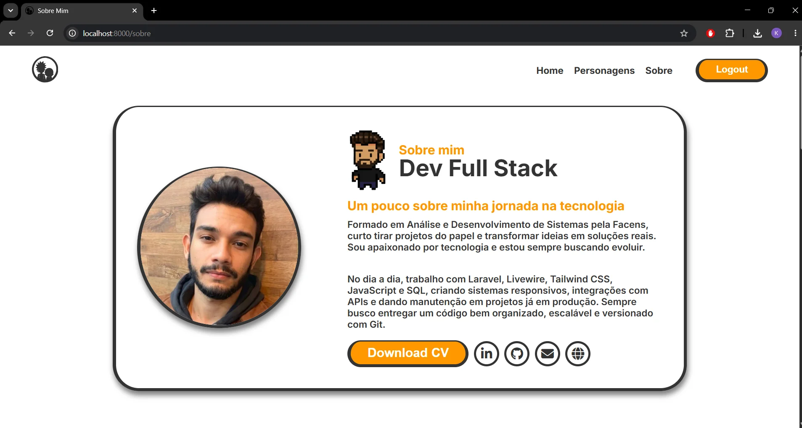
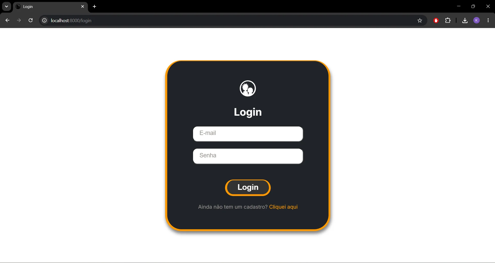
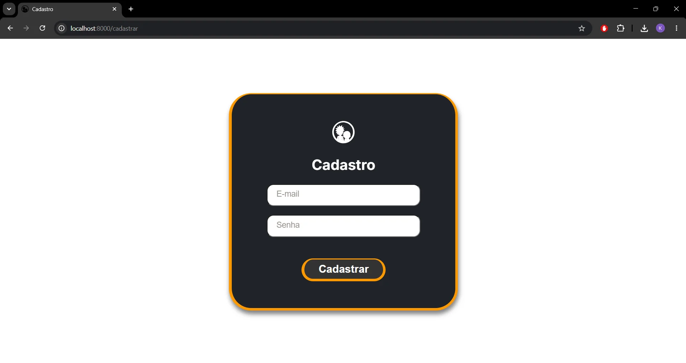
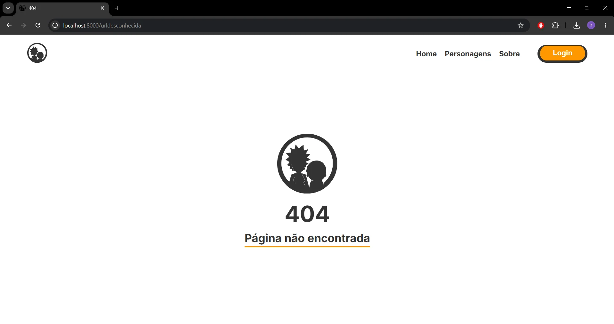

# Consumo da API Rick and Morty

<p align="center">
    
</p>

## Tecnologias utilizadas

- PHP 8.2 
- SQLite
- Front-end com requisições assíncronas JavaScript

## Sobre o projeto

Esta aplicação foi desenvolvida como parte do processo seletivo para desenvolvedor da [Vitafor](https://www.vitafor.com.br/). <a href="https://www.vitafor.com.br/" target="_blank"> </a>

O sistema consome a API do [Rick and Morty](https://rickandmortyapi.com/) para exibir informações dos personagens de forma dinâmica por meio de requisições assíncronas em JavaScript.

Além da integração com a API, a aplicação possui um sistema próprio desenvolvido em PHP, permitindo que usuários autenticados salvem personagens em um banco de dados SQLite e realizem operações completas de gerenciamento (CRUD).

### Funcionalidades

- Consumo da API do [Rick and Morty](https://rickandmortyapi.com/)
- Listagem dinâmica de personagens
- Sistema de autenticação (Login e Cadastro)
- Salvamento de personagens no banco de dados local
- Edição de personagens salvos
- Exclusão de personagens

## Como executar o projeto

### 1. Clone o repositório
   
```bash 
    https://github.com/Kaique-GM/rick-morty-api-test.git
```

### 2. Inicie o servidor

```bash 
    php -S localhost:8000 -t public
```

### 3. Acesse a aplicação

```bash 
    http://localhost:8000
```

## Estrutura do banco de dados

O projeto utiliza um banco de dados SQLite. As tabelas foram estruturadas utilizando os seguintes comandos SQL:

```bash 
    CREATE TABLE users ( 
        id INTEGER PRIMARY KEY AUTOINCREMENT, 
        email TEXT NOT NULL UNIQUE, 
        password TEXT NOT NULL, 
        created_at DATETIME DEFAULT CURRENT_TIMESTAMP 
    );
```

```bash 
    CREATE TABLE characters ( 
        id INTEGER PRIMARY KEY AUTOINCREMENT, 
        api_id INTEGER NOT NULL, 
        user_id INTEGER NOT NULL, 
        name TEXT NOT NULL, 
        species TEXT, 
        image TEXT, 
        url TEXT, 
        created_at DATETIME DEFAULT CURRENT_TIMESTAMP, 
        updated_at DATETIME DEFAULT CURRENT_TIMESTAMP, 
        
        UNIQUE(api_id, user_id) 
    );
```

## Credenciais para Teste

Para facilitar a avaliação da aplicação, deixei um usuário pré-cadastrado contendo alguns personagens já salvos no banco de dados.

**E-mail**
```bash
evilMorty71@email.com
```

**Senha**
```bash
iHateRickys123
```
Você também pode criar uma nova conta para testar o fluxo completo de cadastro, login e gerenciamento de personagens.

## Páginas da aplicação

### HOME 

A Home é responsável por exibir a listagem de personagens consumidos diretamente da API do Rick and Morty.

<p align="center"> 
   
</p> 

### DETALHES DO PERSONAGEM 

A tela de detalhes exibe todas as informações do personagem selecionado. Quando o personagem é salvo no banco de dados e o usuário está autenticado, também são disponibilizadas as opções para editar e excluir o registro.

<p align="center"> 
   
  
</p> 

### PERSONAGENS

A página **Personagens** exibe os personagens salvos no banco de dados pelo usuário. A interface possui três estados distintos: 

- **Logado com personagens salvos:** lista todos os personagens armazenados, permitindo acessar seus detalhes. 
- **Logado sem personagens salvos:** exibe uma mensagem informando que ainda não há personagens cadastrados. 
- **Deslogado:** solicita que o usuário realize o login para visualizar e gerenciar seus personagens.

<p align="center"> 
     
     
    
</p>

### SOBRE

A página **Sobre** é um espaço onde me apresento, compartilhando um breve resumo sobre minha trajetória, experiência profissional, projetos desenvolvidos e links para meu GitHub, portfólio, LinkedIn e contato por e-mail.

<p align="center"> 
   
</p>


### TELA DE LOGIN/CADASTRO

As telas de **Login** e **Cadastro** permitem que o usuário acesse uma conta existente ou crie uma nova para utilizar as funcionalidades da aplicação.

<p align="center"> 
   
  
</p> 

### PÁGINA NÃO ENCOTRADA

A página **404** é exibida quando o usuário tenta acessar uma rota inexistente, apresentando uma mensagem informando que a página solicitada não foi encontrada. 

<p align="center"> 
    
</p>